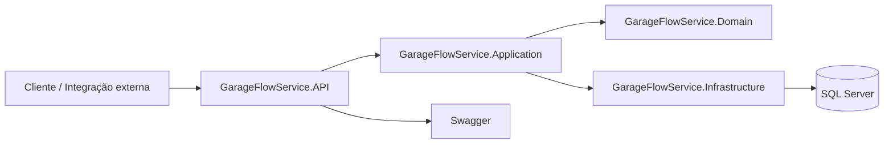

# fiap-tech-challenge-2026

Backend (MVP) para gestão de ordens de serviço da oficina GarageFlow Service, desenvolvido para o Tech Challenge da pós-graduação em Software Architecture da FIAP. 

Por Eduarda Aguiar Angelo e Raphael Barbosa Rodrigues.

## Tecnologias


## Arquitetura

O projeto segue **Clean Architecture** com conceitos de **DDD**:

```text
src/
├── GarageFlowService.Domain/          # Entidades, enums, interfaces, exceções
├── GarageFlowService.Application/     # Casos de uso, DTOs, interfaces de aplicação
├── GarageFlowService.Infrastructure/  # EF Core, repositórios, UnitOfWork
└── GarageFlowService.API/             # Controllers, autenticação, Swagger

tests/
└── GarageFlowService.Tests/           # Testes unitários
```

# fiap-tech-challenge-2026

Backend da oficina GarageFlow Service para a fase 2 do Tech Challenge da FIAP. A solução evolui a base da fase 1 com foco em qualidade de código, automação, resiliência e escalabilidade, mantendo a arquitetura em camadas e o SQL Server como persistência principal.

## Visão geral

Esta entrega cobre:

- Clean Architecture com separação entre `Domain`, `Application`, `Infrastructure` e `API`.
- Fluxo de ordens de serviço com abertura, status, orçamento, listagem ordenada e atualização por notificação.
- Testes automatizados unitários e de integração.
- Containerização com Docker e execução local com Docker Compose.
- Manifestos Kubernetes em [k8s](k8s).
- Bootstrap local com Terraform em [infra](infra).
- Pipeline de CI/CD com build, testes, imagem Docker e deploy.

## Arquitetura



### Componentes

- `GarageFlowService.API`: controllers, autenticação JWT e Swagger.
- `GarageFlowService.Application`: casos de uso, DTOs e regras de aplicação.
- `GarageFlowService.Domain`: entidades, enums, exceções e regras centrais.
- `GarageFlowService.Infrastructure`: EF Core, repositórios e Unit of Work.
- `tests/GarageFlowService.Tests`: cobertura automatizada da base.

## Requisitos cobertos na fase 2

- Abertura de ordem de serviço com cliente, veículo, serviços e peças.
- Consulta de status da OS.
- Aprovação ou recusa de orçamento por endpoint externo simulado.
- Listagem com ordenação por status e antiguidade.
- Exclusão lógica das OS finalizadas e entregues na listagem.
- Atualização de status da OS por notificação simulada.
- Docker, Docker Compose, Kubernetes, Terraform e CI/CD.

## Execução local

### Pré-requisitos

- .NET 8 SDK
- Docker Desktop ou Docker Engine + Compose
- Acesso ao banco RDS em `garage-flow.cxcyk20y6fws.us-east-2.rds.amazonaws.com:1433`

### Subir a aplicação

```bash
docker compose up -d --build
```

Esse comando sobe apenas a API localmente. O banco agora é o RDS remoto configurado na connection string.

### Aplicar o banco local

Execute as migrações se estiver rodando fora do container:

```bash
dotnet ef database update --project src/GarageFlowService.Infrastructure --startup-project src/GarageFlowService.API
```

### Seed do banco

```bash
sqlcmd -S garage-flow.cxcyk20y6fws.us-east-2.rds.amazonaws.com,1433 -U garage_flow -P "root12345" -i seed-database.sql
```

### Swagger

- `http://localhost:5000/swagger`

## Kubernetes

Os manifests ficam em [k8s](k8s) e usam `kustomize`.

### Aplicar localmente

```bash
kubectl apply -k k8s
```

### Recursos criados

- Namespace `garageflow`.
- ConfigMap para variáveis não sensíveis.
- Secret para connection string, JWT e credenciais.
- Deployment e Service da API.
- Deployment e Service do SQL Server.
- HPA da API.

Observação: o manifesto da API usa um placeholder de imagem GHCR que é substituído pelo pipeline de CI/CD antes do deploy. Para aplicar manualmente, ajuste o `image` em [k8s/api-deployment.yaml](k8s/api-deployment.yaml).

## Terraform

Os scripts estão em [infra](infra).

### O que é provisionado

1. Cluster Kubernetes local com `kind`.
2. Aplicação automática dos manifests de [k8s](k8s).
3. Ambiente pronto para demonstrar a aplicação e o banco.

### Como aplicar

```powershell
cd infra
terraform init
terraform apply
```

## CI/CD

O pipeline está em [.github/workflows/ci-cd.yml](.github/workflows/ci-cd.yml).

Etapas cobertas:

- Restore, build e testes da solução.
- Build e push da imagem Docker para GHCR.
- Deploy no cluster Kubernetes usando `kubectl apply -k k8s`.

## API

### Autenticação

`POST /api/auth/login`

Credenciais padrão:

```json
{
  "username": "admin",
  "password": "Admin@123"
}
```

### Work Orders

- `GET /api/workorders`
- `GET /api/workorders/{id}`
- `GET /api/workorders/{id}/status`
- `GET /api/workorders/{id}/budget`
- `POST /api/workorders` (auth)
- `PATCH /api/workorders/{id}/status` (auth)
- `POST /api/workorders/{id}/status/notification`
- `POST /api/workorders/{id}/budget/decision`
- `POST /api/workorders/{id}/services` (auth)
- `POST /api/workorders/{id}/parts` (auth)

### Customers

- `GET /api/customers`
- `GET /api/customers/{id}`
- `POST /api/customers` (auth)
- `PUT /api/customers/{id}` (auth)

### Vehicles

- `GET /api/vehicles/customer/{customerId}`
- `POST /api/vehicles` (auth)

### Services

- `GET /api/services`
- `POST /api/services` (auth)

### Parts

- `GET /api/parts`
- `POST /api/parts` (auth)
- `PATCH /api/parts/{id}/stock` (auth)

## Collection e vídeo

- Collection completa das APIs: adicionar o link final da Postman Collection, Swagger exportado ou similar.
- Vídeo demonstrativo: adicionar o link final do YouTube ou Vimeo com até 15 minutos.

## Testes

```bash
dotnet test src/tests/GarageFlowService.Tests/GarageFlowService.Tests.csproj
```

## Observações

- A aprovação de orçamento e a atualização por notificação foram modeladas como integrações simuladas/plugáveis.
- A solução foi organizada para demonstrar evolução sustentável da fase 1, sem reescrever a base funcional existente.

## Pré-requisitos

- `.NET 8 SDK`
- `Docker Desktop` (ou Docker Engine + Compose)

## Como iniciar o projeto

Na raiz do repositório (`fiap-tech-challenge-2026`):

```bash
docker compose up -d --build
```

#### Inicializar o banco de dados

Após os containers estarem rodando, execute as migrações do Entity Framework para criar as tabelas:

```bash
dotnet ef database update --project src/GarageFlowService.Infrastructure --startup-project src/GarageFlowService.API
```

#### Popular o banco com dados de teste

Execute o script de seed para inserir dados de teste:

```bash
sqlcmd -S localhost,1433 -U sa -P "FIAP@2026" -i seed-database.sql
```

Swagger:
- `http://localhost:5000/swagger`

## Autenticação

`POST /api/auth/login`

**Credenciais padrão para teste:**
```json
{
  "username": "admin",
  "password": "Admin@123"
}
```

## Endpoints principais

### Work Orders
- `GET /api/workorders`
- `GET /api/workorders/{id}`
- `GET /api/workorders/{id}/budget`
- `POST /api/workorders` (auth)
- `PATCH /api/workorders/{id}/status` (auth)
- `POST /api/workorders/{id}/services` (auth)
- `POST /api/workorders/{id}/parts` (auth)

### Customers
- `GET /api/customers`
- `GET /api/customers/{id}`
- `POST /api/customers` (auth)
- `PUT /api/customers/{id}` (auth)

### Vehicles
- `GET /api/vehicles/customer/{customerId}`
- `POST /api/vehicles` (auth)

### Services
- `GET /api/services`
- `POST /api/services` (auth)

### Parts
- `GET /api/parts`
- `POST /api/parts` (auth)
- `PATCH /api/parts/{id}/stock` (auth)
